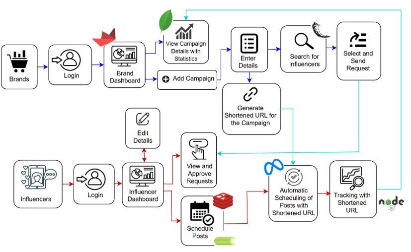

# Influencer Marketing Automation Platform

A full-stack platform enabling brands and influencers to collaborate seamlessly with smart influencer matching, automated post scheduling, and end-to-end campaign tracking. Built to save time, improve targeting, and deliver measurable results.

<p align="center">
  
</p>---

## Features

- **Smart Influencer Matching**  
  Recommend niche-aligned influencers using filtering and a K-Nearest Neighbors (KNN) algorithm.

- **Automated Post Scheduling**  
  Upload media, set captions, and schedule posts across Instagram and Facebook. Powered by Celery and the Graph API.

- **Campaign Tracking with Short URLs**  
  Track clicks, conversions, and user data via campaign and conversion links. Visualize insights with a rich dashboard.

## Architecture Diagram
<p align="center">
  
</p>

---
## Tech Stack

###  Frontend
- **Streamlit** – Lightweight UI for brands and influencers to interact with the platform

###  Backend
- **Flask (Python)** – API for influencer matching, post scheduling, and media handling  
- **Node.js** – Short URL generation and click tracking service

###  Database
- **MongoDB** – Stores influencer profiles, post data, campaign metrics

###  Task Scheduling
- **Celery** – Handles scheduled post execution
- **Redis** – Message broker for Celery tasks

###  Media Storage
- **Google Drive API** – Media files are uploaded and linked via public URLs

### External APIs
- **Facebook Graph API** – For posting to Facebook Pages
- **Instagram Graph API** – For scheduling and publishing posts to Instagram


## 🤝 Collaboration & Contribution

We welcome contributions! To get started:

1. Fork the repository  
2. Create your feature branch  
   ```bash
   git checkout -b feature/your-feature-name
   ```
3. Commit your changes  
   ```bash
   git commit -m "Add awesome feature"
   ```
4. Push to the branch  
   ```bash
   git push origin feature/your-feature-name
   ```
5. Submit a pull request 🚀

---

## Contributors:
 
<a href="https://github.com/Rithikakalaimani">
  
</a>
<a href="https://github.com/kv-06">
  
</a>
<a href="https://github.com/ckritk">
  
</a>


## Support

Have questions or feedback?  
Open an [issue](https://github.com/ckritk/influencer-platform/issues).

---

## License

This project is licensed under the **MIT License**. See the [LICENSE](LICENSE) file for details.

---
